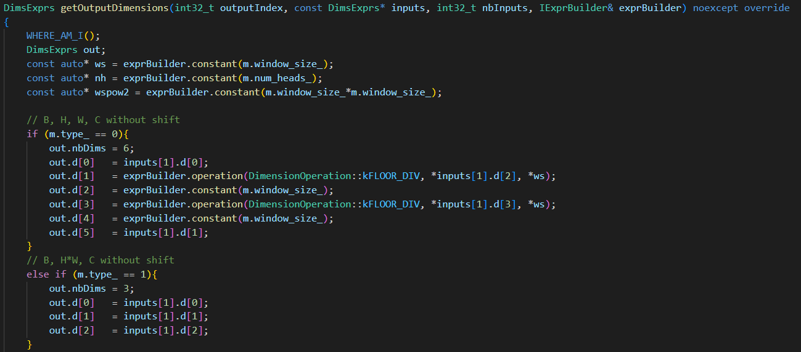
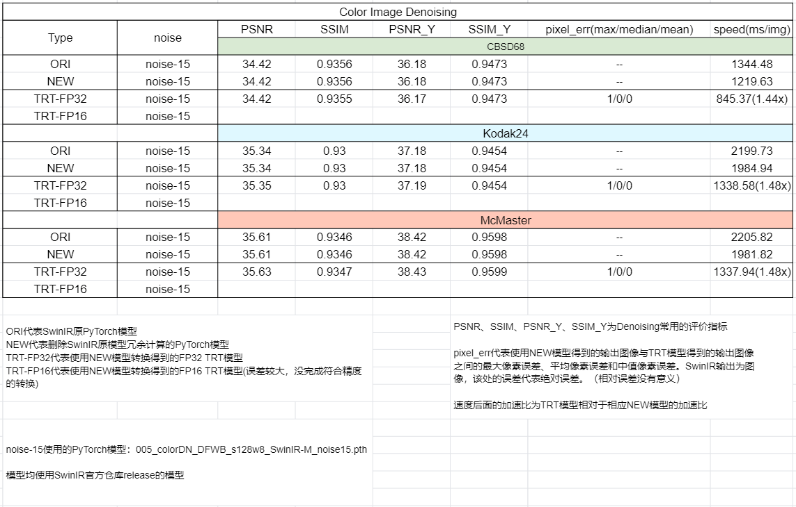

## 总述  
**队伍名称**：摇阿摇  
**复赛优化模型**：[SwinIR-测试](https://github.com/JingyunLiang/SwinIR)  
上述链接中只包含测试代码，如果需要训练代码，请查看[SwinIR-训练](https://github.com/cszn/KAIR/blob/master/docs/README_SwinIR.md)  
在复赛过程中我们只对训练好的模型进行优化加速，所以只使用测试代码就足够了，本项目对SwinIR中的超分、去噪两个任务分别进行了TensorRT模型转化  

## 原始模型
### 模型简介
- **用途以及效果**  
  SwinIR是一个图像增强模型，可用于图像超分辨率、图像去噪以及图像压缩，且在前述领域中SwinIR性能达到SOTA  
<br/>

- **业界实际运用情况**  
  工业界尚无明确使用SwinIR的用例。但SwinIR性能优越，模型扩展性强，代码简洁易懂，如果有成熟的部署方案的话，相信会有不少团队会愿意尝试在工业界使用SwinIR  
<br/>

- **模型的整体结构**  
  模型由三个部分组成：浅层特征提取模块，深层特征提取模块，高质量重建模块。其中浅层特征模块和高质量重建模块都是基于卷积构建而成的，而深层特征提取模块是基于Swin-Transformer构建的，是一个CNN和Transformer结合的模型  

### 模型优化的难点

**PyTorch模型导出ONNX模型时，会形成大量的算子**
16.4MB的002_lightweightSR_DIV2K_s64w8_SwinIR-S_x2.pth模型导出ONNX后，ONNX包含了29308个节点。64.2MB的001_classicalSR_DF2K_s64w8_SwinIR-M_x2.pth模型导出ONNX后，ONNX包含了43819个节点。而初赛中，136MB的encoder模型导出ONNX后，只有1990个节点。大量的节点导致导出ONNX时很容易出现显存不足的问题，同时也不利于ONNX模型的可视化和分析。  

**动态范围更广**
相比于检测/分割等高级语义任务，SwinIR是一个用于低级语义任务的模型，其动态推理要求更高。如检测任务中，常见的动态推理通常只限于batch层面的动态，而输入图片尺寸H/W是固定的。但是在超分、去噪、JPEG压缩等任务中，往往不能提前将输入图片resize成某一固定尺寸，而是要求原图尺寸输入，所以低级语义任务中，输入尺寸H/W也需要是动态的。因为推理过程中需要动态获取H/W信息，所以这也是产生额外shape相关节点的原因之一。  

**转换TRT模型时，涉及形状相关的操作会报错**
SwinIR模型转换为ONNX模型后，产生大量算子的原因有两个：1、计算attention mask需要使用大量的算子；2、模型中存在大量reshape相关的操作，因为动态推理中reshape操作需要在运行过程中获取shape信息，所以会产生大量的shape相关的算子。而这些涉及到shape相关操作的部分，在ONNX转TRT过程中会报错。  
  
 

## 优化过程  
**代码框架**
```shell
代码框架与SwinIR原仓库结构基本保持一致
.
├── figs          # README.md相关的图片
|
├── model_zoo     # SwinIR pth模型
│    └── swinir
|      └── download.sh 模型下载脚本
|
├── models        # 模型代码文件
│   ├── network_swinir_ori.py # 原模型文件
│   └── network_swinir.py # 改进后模型文件
|
├── onnx_zoo      # ONNX模型文件和Plan模型文件
|
├── plugin        # plugin文件
│   ├── ...
│   └── build.sh  # 编译脚本
|
├── testsets      # 测试用的部分数据
|
├── utils         # 构建模型相关的工具
├── export.py     # 用于导出ONNX模型
├── main_test_swinir.py  # 用于测试PyTorch模型
├── onnx2trt.py   # 用于转化TRT模型
├── surgeon.py    # 用于ONNX surgeon
├── testTRT.py    # 用于TRT模型
└── README.md
```

前面四个部分（原PyTorch模型优化、shape相关节点的优化、Window mask 优化、Gather 优化）的优化是为了能让模型正常运行起来。后面两个部分（Nsight Systems 优化、FP16模式 优化）是为了让模型跑更快。

**原PyTorch模型优化**  
原代码模型存在大量的冗余计算，如window mask的计算会在每个block中重复计算，而这些block的window mask是一样的，将这些window mask计算提前，并且以参数形式传入每个block中，可以大量减少onnx模型的节点数量，且可以提升模型的速度。如16.4MB的002_lightweightSR_DIV2K_s64w8_SwinIR-S_x2.pth模型导出ONNX后，ONNX包含了29308个节点。经过改进后的PyTorch模型只有6178个节点，节点数只有原来的21%。速度上也有所提升，可见[精度与加速效果](#精度与加速效果)。

**shape相关节点的优化**  
在测试过程中，转化TRT模型时会出现以下报错  
  
后续我们发现原因是因为H\W是动态的，导致Reshape算子不能正常根据输入形状reshape tensorrt。我们的做法是将所有动态reshape的算子都换成plugin实现，plugin进行reshape的方法是，根据输入的形状进行reshape，这样可以避免显式获取tensor shape进行reshape的情况。涉及到的plugin为./plugin中的STReshapeAddPlugin、STReshapePlugin、STReshapeRollPlugin。最终我们可以实现surgeon后的模型不再存在显式获取tensor shape的操作。  
  
上述为reshape相关plugin算子中的getOutputDimensions函数，其中input[1]是一个参考tensor，其并不参与真实的计算，只用来计算output tensor的shape。使用surgeon.py文件可以  

**Window mask 优化**  
shift mask的编号赋值操作（下图中红框的位置），会在转换onnx模型是产生上千个节点，且直接转换TRT模型会报错，我们把这部分的操作写成了WindowsMaskPlugin。  
  
下面为直接转换的报错信息，与shape相关操作的报错信息一致
  
且换成Plugin之后，该部分的计算时间由13ms降至0.21ms。

**Gather 优化**  
gather操作对应的是代码中得到q、k、v的操作，直接转TRT模型会发生下图的报错  
  
  
  
最终我们将其写成了MyGatherPlugin

**Nsight Systems 优化**  
使用Nsight System进行可视化后，发现有个占总耗时6%左右的scale算子，其是在Reshape相关的plugin周围的算子，而且是较为简单的Add节点，我们进一步将这部分的节点融进plugin中，减少Kernel调用的时间。
  
将这些节点合并入plugin后，再使用Nsight System进行可视化，可以看到运行时间由121ms下降到了179ms。且scale节点已不存在。
  

**FP16模式 优化**  
经过上面的优化，在超分去噪任务中，PyTorch模型都可以转化为FP32的TRT模型，但是在FP16中，三个模型的精度下降都比较大，为此，我们将LayerNorm plugin(初赛中效果较好，直接沿用)中的计算更换为float类型计算，计算完之后再转化为相应的输出类型，从而实现Lightweight Image Super-Resolution任务的模型能转换为符合精度要求的FP16模型，但遗憾的是，Classical Image Super-Resolution任务和Color Image Denoising任务的FP16模型精度还是不符合要求。
 

## 测试流程
**Docker**  
建议使用[NGC](https://catalog.ngc.nvidia.com/orgs/nvidia/containers/tensorrt)  
本项目代码在TensorRT 8.2.5.1与TensorRT 8.4.1.5中均通过测试。

**安装**  
```bash
apt-get install libgl1-mesa-glx
pip install nvidia-pyindex # 需要单独先安装 nvidia-pyindex
pip install -r requirments.txt 
```


**下载预训练模型&编译plugin**
```bash
cd model_zoo/swinir
chmod +x ./download.sh
# 为了节省时间，只下载部分模型，需要下载其他模型，可以对脚本进行修改
./download.sh

cd ../../plugin
chmod +x ./build.sh
./build.sh
```

**PyTorch测评**
```python
# Classical Image Super-Resolution
python main_test_swinir.py --task classical_sr --scale 2 --training_patch_size 64 --model_path model_zoo/swinir/001_classicalSR_DF2K_s64w8_SwinIR-M_x2.pth --folder_lq testsets/Set5/LR_bicubic/X2 --folder_gt testsets/Set5/HR

# Lightweight Image Super-Resolution
python main_test_swinir.py --task lightweight_sr --scale 2 --model_path model_zoo/swinir/002_lightweightSR_DIV2K_s64w8_SwinIR-S_x2.pth --folder_lq testsets/Set5/LR_bicubic/X2 --folder_gt testsets/Set5/HR

# Color Image Denoising
python main_test_swinir.py --task color_dn --noise 15 --model_path model_zoo/swinir/005_colorDN_DFWB_s128w8_SwinIR-M_noise15.pth --folder_gt testsets/McMaster
```

**导出ONNX模型**
```python
# Classical Image Super-Resolution
python export.py --task classical_sr --scale 2 --training_patch_size 64 --model_path model_zoo/swinir/001_classicalSR_DF2K_s64w8_SwinIR-M_x2.pth --folder_lq testsets/Set5/LR_bicubic/X2 --folder_gt testsets/Set5/HR

# Lightweight Image Super-Resolution
python export.py --task lightweight_sr --scale 2 --model_path model_zoo/swinir/002_lightweightSR_DIV2K_s64w8_SwinIR-S_x2.pth --folder_lq testsets/Set5/LR_bicubic/X2 --folder_gt testsets/Set5/HR

# Color Image Denoising
python export.py --task color_dn --noise 15 --model_path model_zoo/swinir/005_colorDN_DFWB_s128w8_SwinIR-M_noise15.pth --folder_gt testsets/McMaster
```

**ONNX surgeon**
```python
# Classical Image Super-Resolution
python surgeon.py --onnxFile ./onnx_zoo/swinir_classical_sr_x2/001_classicalSR_DF2K_s64w8_SwinIR-M_x2.onnx

# Lightweight Image Super-Resolution
python surgeon.py --onnxFile ./onnx_zoo/swinir_lightweight_sr_x2/002_lightweightSR_DIV2K_s64w8_SwinIR-S_x2.onnx

# Color Image Denoising
python surgeon.py --onnxFile ./onnx_zoo/swinir_color_dn_noise15/005_colorDN_DFWB_s128w8_SwinIR-M_noise15.onnx
```

**导出TensorRT模型**
```python
# Classical Image Super-Resolution
python onnx2trt.py --onnxFile ./onnx_zoo/swinir_classical_sr_x2/001_classicalSR_DF2K_s64w8_SwinIR-M_x2_surgeon.onnx --task classical_sr

# Lightweight Image Super-Resolution
python onnx2trt.py --onnxFile ./onnx_zoo/swinir_lightweight_sr_x2/002_lightweightSR_DIV2K_s64w8_SwinIR-S_x2_surgeon.onnx --task lightweight_sr

# Color Image Denoising
python onnx2trt.py --onnxFile ./onnx_zoo/swinir_color_dn_noise15/005_colorDN_DFWB_s128w8_SwinIR-M_noise15_surgeon.onnx --task color_dn
```

**测试TensorRT模型**(支持动态尺寸H/W)  
```python
# Classical Image Super-Resolution
python testTRT.py --onnxFile ./onnx_zoo/swinir_classical_sr_x2/001_classicalSR_DF2K_s64w8_SwinIR-M_x2_surgeon.onnx --TRTFile ./onnx_zoo/swinir_classical_sr_x2/001_classicalSR_DF2K_s64w8_SwinIR-M_x2_surgeon.plan --task classical_sr --scale 2 --training_patch_size 64 --model_path model_zoo/swinir/001_classicalSR_DF2K_s64w8_SwinIR-M_x2.pth --folder_lq testsets/Set5/LR_bicubic/X2 --folder_gt testsets/Set5/HR

# Lightweight Image Super-Resolution
python testTRT.py --onnxFile ./onnx_zoo/swinir_lightweight_sr_x2/002_lightweightSR_DIV2K_s64w8_SwinIR-S_x2_surgeon.onnx --TRTFile ./onnx_zoo/swinir_lightweight_sr_x2/002_lightweightSR_DIV2K_s64w8_SwinIR-S_x2_surgeon.plan --task lightweight_sr --scale 2 --model_path model_zoo/swinir/002_lightweightSR_DIV2K_s64w8_SwinIR-S_x2.pth --folder_lq testsets/Set5/LR_bicubic/X2 --folder_gt testsets/Set5/HR

# Color Image Denoising
python testTRT.py --onnxFile ./onnx_zoo/swinir_color_dn_noise15/005_colorDN_DFWB_s128w8_SwinIR-M_noise15_surgeon.onnx --TRTFile ./onnx_zoo/swinir_color_dn_noise15/005_colorDN_DFWB_s128w8_SwinIR-M_noise15_surgeon.plan --task color_dn --noise 15 --model_path model_zoo/swinir/005_colorDN_DFWB_s128w8_SwinIR-M_noise15.pth --folder_gt testsets/McMaster
```

最后能得到一张类似下图的TRT-PyTorch模型结果对比表格
 

## 精度与加速效果
下列测试结果均在A10 GPU,TensorRT 8.4.1.5中测试得到
#### Classical Image Super-Resolution
Classical Image Super-Resolution任务中,采用了两种分辨率的原模型进行测试,分别是x2模型和x4模型,模型均采用SwinIR官方仓库[release模型](https://github.com/JingyunLiang/SwinIR/releases),并在多个数据集上进行测试,数据集下载可见[SwinIR官方仓库](https://github.com/JingyunLiang/SwinIR),FP32模型和FP16模型的加速比如下图所示
  

#### Lightweight Image Super-Resolution
Lightweight Image Super-Resolution任务中,采用了两种分辨率的原模型进行测试,分别是x2模型和x4模型,模型均采用SwinIR官方仓库[release模型](https://github.com/JingyunLiang/SwinIR/releases),并在多个数据集上进行测试,数据集下载可见[SwinIR官方仓库](https://github.com/JingyunLiang/SwinIR),FP32模型和FP16模型的加速比如下图所示
  

#### Color Image Denoising
Color Image Deoising任务中,采用了一种噪声程度的原模型进行测试,noise-15,模型均采用SwinIR官方仓库[release模型](https://github.com/JingyunLiang/SwinIR/releases),并在多个数据集上进行测试,数据集下载可见[SwinIR官方仓库](https://github.com/JingyunLiang/SwinIR),FP32模型和FP16模型的加速比如下图所示
  
## Bug报告（可选）
无

## 经验与体会（可选）
无